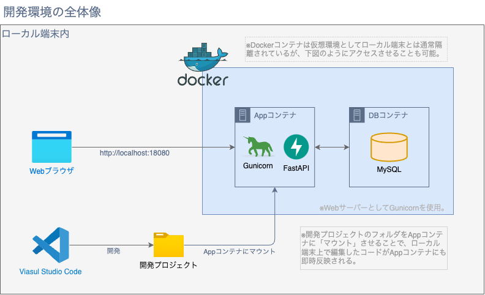

# Python Backend Railway
Python バックエンド 初級編

## 環境構築

1. Python 3.12
2. Docker Desktop
3. Visual Studio Code
4. Git

上記は必ずインストールした上で始めてください。

### Macにおける環境構築
[MacOSにおける環境構築について](./docs/README-mac.md) を参照ください。

### Windows における環境構築
[Windowsにおける環境構築について](./docs/README-windows.md) を参照ください。

## このRailwayについて
このRailwayで扱う技術要素やカバーする範囲、利用する開発環境について説明します。

### 扱う技術要素
Python製WebアプリケーションフレームワークであるFastAPIを使用したWebAPIの開発

<details>
<summary>FastAPIについて</summary>
FastAPIはPython言語を使用した、Webアプリケーション向けのフレームワークです。

2018年12月に最初のリリースが行われ、2021年頃から大きくシェアを伸ばし、2023年には Python の Web アプリケーションフレームワークで Django や Flask に次ぐフレームワークに成長しています。

Java 開発者向けの統合開発環境として知名度の高い IntelliJ IDEA などを開発している JetBrains 社の開発者のエコシステムに関するレポートでは、

FastAPI の使用率が 25% に増加している事を報告しており、 Django の 40% や Flask の 38% には及ばないものの、過去数年で大きく利用率を伸ばしてきている存在として、注目されています。

FastAPI は容易に WebAPI が開発でき、少ないコードの記述で実装できることや効率的な処理を実現するための仕組み、開発している API を UI 上で確認するための仕組みなど WebAPI の開発を支援する仕組みが標準で組み込まれています。
</details>

### カバーする範囲
今回は実際に動くものをまずは作ってみるという点にフォーカスしカバーする範囲を以下の通り決めています。

**【凡例】✅:  カバー / ❌: 今回のRailwayでは取り扱わない点**
- ✅ FastAPI を利用した WebAPI ( REST API ) の基本的な開発
- ✅ アプリケーションからリレーショナルデータベースへの連携 ( CRUD 処理 )
- ✅ SwaggerUI を用いた API のお試し実行
- ❎ データベースのテーブル設計
- ❌ SQLAlchemy や Alembic など FastAPI 以外のパッケージ導入
- ❌ REST API の設計
- ❌ 開発環境の構築方法
- ❌ FastAPI のより発展的な利用方法
- ❌ テストコードの実装方法

### 開発環境

- この Railway で使用する開発環境は Docker の仮想環境をアプリケーションの実行環境としています。 ( 環境構築が再現性高くスピーディにおこえる事を目的としている )
- アプリケーション本体用の Docker コンテナである App コンテナ、アプリケーションと連携させるデータベース用のコンテナである DB コンテナの 2 つが、連携して Docker 環境内で稼働する形となります。

#### 言語・バージョン
- Python 3.12

#### 使用ライブラリ
- フレームワーク
    - [FastAPI](https://fastapi.tiangolo.com/ja/)(Gunicorn含む)
- O/Rマッパー
    - [SQLAlchemy](https://www.sqlalchemy.org/)
- マイグレーションツール
    - [Alembic](https://alembic.sqlalchemy.org/en/latest/)
- テスティングフレームワーク
    - [Pytest](https://docs.pytest.org/en/stable/)
- リンター/フォーマッター
    - [Ruff](https://docs.astral.sh/ruff/)

## 主に使用しているVSCode拡張機能
- [Python](https://marketplace.visualstudio.com/items?itemName=ms-python.python)
- [Pylance](https://marketplace.visualstudio.com/items?itemName=ms-python.vscode-pylance)
- [Ruff](https://marketplace.visualstudio.com/items?itemName=charliermarsh.ruff)

## プロジェクト構造
```
.
├── .techtrain
│   └── TechTrain合格判定用ディレクトリ(触れない)
├── .vscode
│   └── VSコードのワークスペースの設定ファイルが置かれる。(このリポジトリでは、推奨拡張機能の構成ファイルのみ管理しています。)
├── README.md
├── alembic.ini
├── app
│   ├── __init__.py
│   ├── database.py
│   ├── main.py
│   └── models
│       ├── __init__.py
│       └── (SQLAlchemyのためのモデル定義群)
├── docker-compose.yml
├── docs
│   └── (READMEから参照するドキュメント類)
├── infra
│   └── docker
│       └── (Docker Compose環境に必要なファイル群)
├── migration
│   ├── README
│   ├── env.py
│   ├── script.py.mako
│   └── versions
│       ├── (DBマイグレーションファイル)
├── pyproject.toml
├── test-outputs
│   └── (TechTrain合格判定用テスト結果レポートファイル格納先)
└── tests
    └── (合格判定用テストコード群)
```
