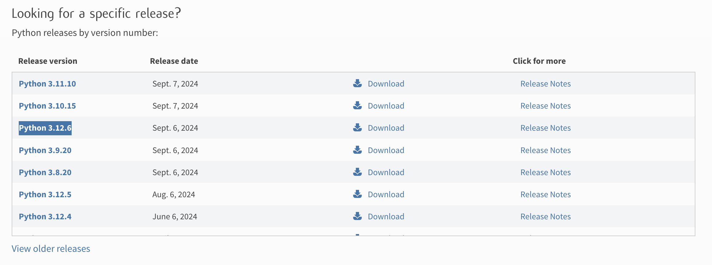
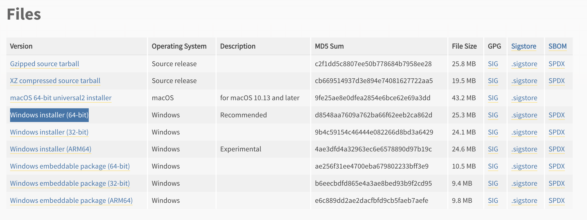

# Python 環境セットアップ - Windows 編

この手順では Windows 環境下における `Python 3.12` のインストール手順を説明しています。
※他のバージョンでも動く可能性はありますが、動作を安定させるために上記のバージョンでインストールすることをおすすめいたします。

## Python のインストール
1. Windows ユーザーの場合、  以下にアクセスし、 Python3.12 の最新版をインストールしましょう。
    1. [python.org - Downloads](https://www.python.org/downloads/)
    2. ページ下部に以下のような一覧が存在するため、3.12系のバージョンを選択してください。このスクリーンショットの場合、`Python 3.12.6` が該当します。
        
    3. リンクを押下して遷移したページの下部に以下スクリーンショットで示すようにインストールするためのファイルリンクがあるため、Windows 用インストーラーのリンクを選択してダウンロードしてインストールを行ってください。
        

        ※このスクリーンショットの例では、`Windows installer (64-bit)`を選択する手順として掲載していますが、使っている Windows のバージョンによっては、 `Windows installer (32-bit)` を選択する場合もある点に留意ください。
    4. ダウンロードしたインストーラを実行し、画面の手順に従っってインストールを進めていただき、正常にインストールが完了したことを確認できれば、 Python のインストールは完了です。
2. インストール実行が正常に完了後、ターミナルで以下コマンドを実行し、バージョンが表示されていればインストールが行えています。
    1. `python3.12 -V`

## 仮想環境のセットアップ
ローカルにインストールした Python では、 Python 標準だけの機能だけでなく、

アプリケーション開発を効率的に行うため必要な Python 用パッケージをインストールして使用することが多くの場合必要となります。

( FastAPI や numpy 、pandas も Pythonパッケージの一つ )

Python 用パッケージのインストールには、

ここでは、[pip](https://packaging.python.org/ja/latest/key_projects/#pip) という Python パッケージ管理ツールを使用します。

Python パッケージ管理ツールには pip 以外にもさまざまなものがありますが、最も広く使われており、最近の Python には同梱されていることから、この Railway では pip を使用します。

1. ローカル Python 環境の仮想環境を作成し、VSCode で開いているプロジェクトに適用する。
    1. VSCode でコードを編集する際は、ローカル環境上となり、VSCode の構文解析等を有効に働かせるためにローカル環境でも Python 環境を準備します。
    2. リポジトリを VSCode で開いた後、VSCode 上でターミナルを開くとプロジェクト直下をカレントディレクトリとしてターミナルが開きます。
    3. その状態で以下コマンドを実行します。
        ```bash
        python3.12 -m venv .venv
        ```
        このコマンドを実行すると、プロジェクト直下に `.venv` ディレクトリが作成されます。
    4. VSCodeにて「 Cmd + Shift + P 」でVSCodeのコマンドパレットを開きます。コマンドパレットにて「`Python: インタープリターを選択`」を選択します。

        以下のように途中まで入力すると選択肢が絞られていって見つけやすくなると思います。
        
    5. 選択後、インタープリターの一覧が表示されますが、以下の`.\.venv\bin\python`がパスとして表示されているものを選択してください。
        
    6. 上記で対応完了となります。現在どこの Python インタープリターが選択されているかは、VSCode で`.py`ファイルを開くと、VSCode のウィンドウ最下部に表示されます。
        
    7. また、`.venv`配下の Python インタープリターを選択していると、VSCode 上でターミナルを新規で開いた時に予めターミナル上でも venv の仮想環境が有効になった状態でターミナルが起動されます。
    
    →「(.venv)」という文言が表示されている。
2. 利用する Python パッケージを Python 仮想環境配下にインストールする。
    1. 上記の手順にて VSCode のターミナルで venv が有効になっている状態で立ち上がる旨を説明しました。
    2. venv が有効化されている状態のターミナルで以下を実行し、仮想環境下で必要な Python パッケージをインストールします。
        ```bash
        pip install -r ./infra/docker/app/requirements/dev.txt
        ```
        ※アップデートを促されることもありますが、こちらはアップデートしても問題ございません。
        